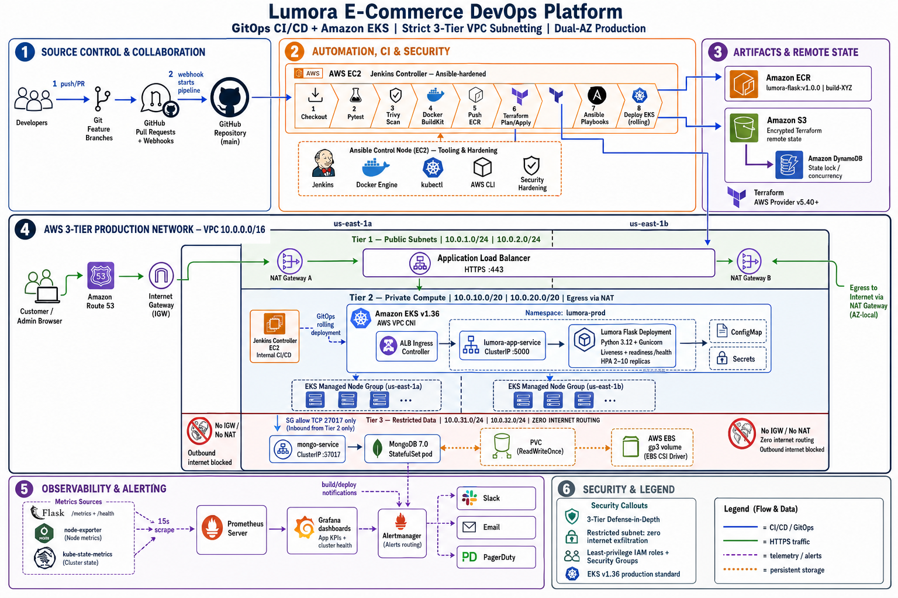

# 🛍️ Lumora E-Commerce Application

Lumora is a full-stack e-commerce web application developed using **Python Flask and MongoDB**.

This repository serves as the base application for an **End-to-End DevOps Capstone Project**, demonstrating CI/CD automation, cloud infrastructure provisioning, container orchestration with Kubernetes on AWS, security scanning, and full-stack observability.

---

# 🏗️ Production Architecture & GitOps CI/CD Pipeline

*Direct Artifact Reference: [`project_artifacts/architecture_diagram.png`](project_artifacts/architecture_diagram_v2.png)*



### 📐 Architecture & Infrastructure Overview

The Lumora DevOps platform implements an enterprise-grade, resilient, multi-AZ cloud architecture on **Amazon Web Services (AWS)** using **GitOps**, **Infrastructure as Code (IaC)**, and **automated CI/CD pipelines**.

```
┌──────────────────────────────────────────────────────────────────────────────────────────────────┐
│                                 LUMORA DEVOPS CLOUD ARCHITECTURE                                 │
├───────────────────────────────┬──────────────────────────────────┬───────────────────────────────┤
│ 1. Source Control & GitOps    │ 2. CI/CD & Security (Jenkins)    │ 3. Artifacts & Remote State   │
│    • GitHub Feature Branches  │    • Pytest Unit Testing         │    • AWS ECR (Container Reg.) │
│    • Pull Requests & Webhooks │    • Trivy Vulnerability Scan    │    • AWS S3 (Terraform State) │
│    • Main Branch Integration  │    • Multi-stage Docker Build    │    • DynamoDB (State Locking) │
├───────────────────────────────┼──────────────────────────────────┼───────────────────────────────┤
│ 4. AWS VPC (Multi-AZ Network) │ 5. Container Workloads (EKS)     │ 6. Observability & Operations │
│    • Dual-AZ Public Subnets   │    • Flask Deployment (Gunicorn) │    • Prometheus Server        │
│    • Dual-AZ Private Subnets  │    • Horizontal Pod Auto (HPA)   │    • Grafana KPI Dashboards   │
│    • AWS ALB + NAT Gateways   │    • MongoDB StatefulSet + EBS   │    • Alertmanager + Slack     │
└───────────────────────────────┴──────────────────────────────────┴───────────────────────────────┘
```

#### 1. 🐙 Source Control & Collaboration
- **Developer Workflow**: Developers work on feature branches and submit Pull Requests to the `main` branch on GitHub.
- **Automated Triggers**: GitHub Webhooks trigger the Jenkins declarative pipeline on every push or merged PR.

#### 2. ⚙️ Automation, CI & Security (Jenkins on AWS EC2)
- **Controller Host**: Jenkins runs on an AWS EC2 instance in a dedicated management security group, fully configured and hardened using **Ansible playbooks** (automating Docker Engine, `kubectl`, AWS CLI, and security tools).
- **Declarative Pipeline Stages**:
  1. `Checkout`: Pulls the latest code repository from GitHub.
  2. `Pytest`: Runs automated unit and functional test suites under `tests/`.
  3. `Trivy Scan`: Scans application files and container dependencies for security vulnerabilities.
  4. `Docker BuildKit`: Builds optimized, secure container images with non-root user (`appuser`).
  5. `Push Image`: Tags images with build numbers and pushes to **Amazon ECR**.
  6. `Terraform Plan/Apply`: Provisions and manages AWS VPC, subnets, and EKS resources with remote state locking.
  7. `Ansible`: Manages host configurations idempotently.
  8. `Deploy to EKS`: Applies rolling updates to Kubernetes workloads using `kubectl`.

#### 3. 📦 Artifacts & IaC State Management
- **Amazon ECR**: Serves as the private container registry for immutable, semantically tagged application images (`lumora-flask`).
- **Amazon S3 & DynamoDB**: Provides secure remote state storage and state locking for Terraform to enable seamless team collaboration.

#### 4. 🌐 AWS Production Network (VPC `10.0.0.0/16`)
- **Multi-AZ Resilience**: Network resources are distributed across **Availability Zone A** and **Availability Zone B**.
- **Public Subnets (`10.0.1.0/24`, `10.0.2.0/24`)**:
  - **Internet Gateway (IGW)** for external inbound/outbound connectivity.
  - **Dual-AZ NAT Gateways** providing secure outbound internet access for private workloads.
  - **AWS Application Load Balancer (ALB)** handling TLS/HTTPS termination on port `443`.
  - **Jenkins EC2 / Bastion Host**.
- **Private Subnets (`10.0.11.0/24`, `10.0.12.0/24`)**:
  - Isolated from direct public internet exposure.
  - Hosts **EKS Managed Node Groups** and all application/database pods.

#### 5. ☸️ Kubernetes Workloads (Amazon EKS — Namespace `lumora-prod`)
- **ALB Ingress Controller**: Routes incoming external traffic to the internal `lumora-app-service` (ClusterIP: `5000`).
- **Flask Application Deployment**:
  - Multi-replica Python 3.12 Flask app running behind **Gunicorn**.
  - Configured with `readinessProbe` and `livenessProbe` monitoring `/health`.
  - Scaled dynamically (2 to 10 replicas) using the **Horizontal Pod Autoscaler (HPA)** based on CPU/memory utilization.
  - Environment configuration managed via Kubernetes `ConfigMap` and secrets via `Kubernetes Secrets`.
- **Database Workload (MongoDB 7.0)**:
  - Deployed as a dedicated `MongoDB StatefulSet` in the private subnet.
  - Internal communication via `mongo-service` (ClusterIP: `27017`) — completely isolated from public access.
  - Data persistence guaranteed using **PersistentVolumeClaim (PVC)** bound to high-performance **Amazon EBS `gp3` volumes** via the **AWS EBS CSI Driver**.

#### 6. 📊 Observability, Alerting & Operations
- **Prometheus**: Time Series Database scraping metrics on a 15-second interval from:
  - `Flask App (/metrics)` & `Flask App (/health)`
  - `node-exporter (/metrics)` on EC2 worker nodes
  - `kube-state-metrics (/metrics)` for pod, deployment, and cluster health
- **Grafana**: Visualizes real-time performance dashboards:
  - **Application KPI Dashboard**: HTTP request rate, response latency, order transactions, error rates.
  - **Infrastructure Dashboard**: Node CPU/RAM utilization, pod restart counts, disk I/O.
- **Alertmanager & Incident Management**:
  - Triggers operational alerts on latency thresholds, pod crash loops, and resource exhaustion.
  - Routes notifications to **Slack**, **Email**, and **PagerDuty**.
  - Integrates Jenkins pipeline build failure notifications.

---

## 🚀 Technology Stack

### Application
- Python
- Flask
- MongoDB
- HTML5
- CSS3
- JavaScript
- Jinja2

### Currently Used DevOps Tools
- Git
- GitHub
- Docker
- Docker Compose

### Planned DevOps Integration
- Jenkins
- Trivy
- Kubernetes
- AWS
- Terraform
- Ansible
- Prometheus
- Grafana


# ✨ Application Features

## 👤 User Authentication

The application provides customer authentication and account management.

- User Registration
- User Login
- User Logout
- Session-based authentication
- Forgot Password
- Password Reset
- Edit Profile
- Customer Account Page
- Activate/Deactivate user support


## 🏠 Home Page

The Lumora storefront provides a modern and responsive shopping experience.

Features include:

- Hero section
- Featured products
- Product collections
- Product cards
- Category navigation
- Responsive design
- Modern Lumora UI theme


## 🛍️ Product Catalogue

Customers can browse available products through the shop.

Features:

- Product listing
- Product search
- Category filtering
- Product details
- Product images
- Product price
- Stock availability
- Product ratings
- Product reviews

Available routes:

text
/
/shop
/product/<product_id>
/categories


## ❤️ Wishlist

Logged-in customers can maintain their personal wishlist.

Features:

- Add product to wishlist
- Remove product from wishlist
- View saved products
- Move wishlist product to shopping cart

Route:

text
/wishlist


## 🛒 Shopping Cart

Customers can manage products before checkout.

Features:

- Add products to cart
- Update quantity
- Remove products
- View subtotal
- Delivery calculation
- Order total calculation

Route:

text
/cart


# 💳 Checkout

The application contains a dedicated checkout workflow.

Customers can provide:

- Name
- Email
- Phone number
- Street address
- City
- State
- Postal code

Demo payment methods:

- Cash on Delivery
- UPI Demo Payment
- Card Demo Payment

> Payment functionality is for demonstration purposes only. No real financial transaction or card processing is performed.

Route:

text
/checkout


# 📦 Order Management

After checkout, orders are stored in MongoDB.

Customers can:

- View recent orders
- View complete order history
- Open individual order details
- View products inside an order
- View quantity and price
- View shipping details
- View payment information
- Cancel eligible orders
- Buy products again
- Download invoice

Routes:

text
/orders
/orders/<order_id>


# 🚚 Order Tracking

Customers can track the progress of their orders.

Typical order lifecycle:

text
Order Placed
      ↓
Confirmed
      ↓
Packed
      ↓
Shipped
      ↓
Out for Delivery
      ↓
Delivered


Cancelled orders are displayed separately.

Route:

text
/track-order


# 🧾 Invoice

Customers can download an invoice for their order.

Invoice information includes:

- Order ID
- Order date
- Customer details
- Delivery address
- Product details
- Quantity
- Unit price
- Subtotal
- Shipping amount
- Total amount
- Payment method
- Order status


# ⭐ Product Reviews & Ratings

Customers who purchased a product can submit a review.

Features:

- 1–5 star rating
- Customer comments
- Verified purchase validation
- Update existing review
- Automatic product rating calculation


# 👤 Customer Account

The customer account page provides access to:

- Profile information
- Edit profile
- Recent orders
- Complete order history
- Wishlist
- Order tracking

Routes:

text
/account
/account/edit


# 👨‍💼 Admin Dashboard

The application includes an administrator dashboard.

The dashboard provides information about:

- Total products
- Total customers
- Total orders
- Revenue
- Recent orders
- Low-stock products
- Revenue analytics

Route:

text
/admin


# 📦 Admin Product Management

Administrators can manage the product catalogue.

Features:

- View products
- Search products
- Add product
- Edit product
- Delete product
- Update price
- Update stock
- Update category
- Update rating
- Add product badge
- Product image URL
- Product image upload

Routes:

text
/admin/products
/admin/products/new


# 👥 Admin Customer Management

Administrators can:

- View registered customers
- Search customers
- View customer profiles
- View customer order history
- View customer spending
- Activate customers
- Deactivate customers

Route:

text
/admin/customers


# 📋 Admin Order Management

Administrators can view customer orders and update their status.

Supported statuses include:

text
CONFIRMED
PACKED
SHIPPED
OUT FOR DELIVERY
DELIVERED
CANCELLED


# 📊 Admin Reports & Analytics

The application provides sales reporting for administrators.

Reports include:

- Revenue trend
- Sales by product
- Revenue by product
- Sales by category
- Revenue by category
- Low-stock products

Route:

text
/admin/reports


# ⚠️ Low Stock Monitoring

Products with stock below the configured threshold are displayed as low-stock products.

The threshold can be configured using:

text
LOW_STOCK_THRESHOLD


# 📧 Email Simulation

Email functionality is simulated for the capstone application.

Currently simulated emails include:

- Order confirmation
- Password reset

Email records are stored in MongoDB for demonstration purposes.

No real SMTP credentials are required.


# 📞 Contact Page

Customers can submit messages through the contact form.

The submitted information is stored in MongoDB.

Route:

text
/contact


# ℹ️ About Page

The application contains a dedicated Lumora brand story and About page.

Route:

text
/about


# 🗄️ MongoDB

MongoDB is used as the backend database.

The application stores information such as:

text
Users
Products
Orders
Wishlist
Reviews
Contact Messages
Email Outbox


# 🐳 Running the Application with Docker

## Prerequisites

Install:

- Git
- Docker Desktop
- Docker Compose

Clone the repository:

bash
git clone https://github.com/Saranyaharish93/hv-ecommerce-devops.git


Move into the project:

bash
cd hv-ecommerce-devops


Build and start the containers:

bash
docker compose up --build


Open the application:

text
http://localhost:5000


# 🐳 Docker Architecture

The local application uses two containers:

text
Browser
   |
   | :5000
   ↓
Flask Application
   |
   | mongodb://mongo:27017
   ↓
MongoDB


Docker Compose provides networking between Flask and MongoDB.


# 🩺 Application Health Check

The application exposes a health endpoint:

text
/health


Example:

text
http://localhost:5000/health


This endpoint will later be used by Docker, Kubernetes and monitoring tools.


# 🧪 Automated Testing

The project contains automated tests under:

text
tests/


Install development dependencies:

bash
pip install -r requirements-dev.txt


Run:

bash
pytest -q


# 📁 Current Project Structure

text
hv-ecommerce-devops/
│
├── app/
│   ├── static/
│   │   ├── css/
│   │   ├── js/
│   │   └── uploads/
│   │
│   ├── templates/
│   ├── __init__.py
│   └── routes.py
│
├── tests/
│
├── Dockerfile
├── docker-compose.yml
├── requirements.txt
├── requirements-dev.txt
├── run.py
├── .dockerignore
├── .gitignore
└── README.md


# 🔐 Demo Administrator

For local demonstration, the application can create an administrator using environment configuration.

Example:

text
ADMIN_EMAIL=admin@lumora.local
ADMIN_PASSWORD=Admin@123


> Demo credentials should not be used in production environments.


# 🚀 DevOps Capstone Roadmap

The current Flask + MongoDB application will be used for the upcoming end-to-end DevOps implementation.

## Phase 1 — Application & Source Control

- [x] Flask application
- [x] MongoDB integration
- [x] E-Commerce functionality
- [x] Automated tests
- [x] Git repository
- [x] GitHub repository

## Phase 2 — Containerization

- [x] Dockerfile
- [x] Docker Compose
- [x] Flask container
- [x] MongoDB container
- [x] Docker networking
- [x] Persistent MongoDB storage

## Phase 3 — Continuous Integration / Delivery

- [ ] Jenkins setup
- [ ] Jenkins pipeline
- [ ] Automated test execution
- [ ] Docker image build
- [ ] Docker image registry
- [ ] Trivy security scanning

## Phase 4 — Infrastructure as Code

- [ ] AWS infrastructure
- [ ] Terraform
- [ ] VPC
- [ ] EKS cluster
- [ ] Worker nodes

## Phase 5 — Configuration Management

- [ ] Ansible
- [ ] Jenkins server configuration
- [ ] Required DevOps tool installation

## Phase 6 — Kubernetes

- [ ] Kubernetes Deployment
- [ ] Kubernetes Service
- [ ] MongoDB deployment
- [ ] ConfigMap
- [ ] Secrets
- [ ] Health probes
- [ ] Horizontal Pod Autoscaler
- [ ] Ingress
- [ ] Rolling updates

## Phase 7 — Monitoring

- [ ] Prometheus
- [ ] Grafana
- [ ] Application monitoring
- [ ] Infrastructure monitoring
- [ ] Grafana dashboards
- [ ] Alerts

## Phase 8 — Final Capstone

- [x] Architecture diagram
- [ ] CI/CD architecture
- [ ] Deployment screenshots
- [ ] Monitoring screenshots
- [ ] Security scan evidence
- [ ] Project documentation
- [ ] Final presentation
- [ ] Viva preparation


# 🎯 Project Objective

The objective of this project is to demonstrate an **end-to-end DevOps lifecycle** using a functional e-commerce application.

The project begins with application development and source control, followed by containerization, continuous integration, automated security scanning, infrastructure provisioning, Kubernetes deployment and application monitoring.


## 👥 Team Project

This repository is being developed as part of the **Hero Vired End-to-End DevOps Capstone Project**.

Team members should create feature branches and submit Pull Requests instead of directly modifying the `main` branch.
