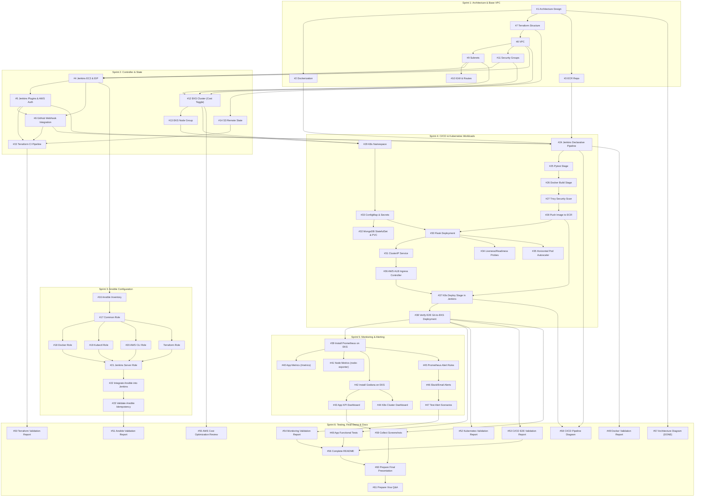

# 🗺️ End-to-End DevOps Capstone: Task Dependency & Execution Roadmap

> **Project Title**: Lumora E-Commerce DevOps Platform (Hero Vired Batch 16A)  
> **Repository**: `Saranyaharish93/hv-ecommerce-devops`  
> **GitHub Project Board**: [HV E-Commerce DevOps Capstone - Batch 16A](https://github.com/users/Saranyaharish93/projects/1)  
> **AWS Account**: `759530261212` | **Region**: `us-east-1`  
> **Jenkins Elastic IP**: `32.195.28.191` | **Controller Instance ID**: `i-03e7a9837cadbced6`  
> **Last Status Audit**: `September 2026` (Post PR #70 & #71 merge to `main`)

---

## 📌 Executive Summary & Current Project State

The project spans **6 Sprints** and **61 Issues / Tasks**. This document serves as the single source of truth for:
1. **Current completion status** across all sprints.
2. **Strict task dependencies** (what cannot start before another task finishes).
3. **Audit findings & technical discrepancies** discovered in the codebase.
4. **Recommended chronological execution order** for the team to prevent bottlenecks and redundant work.

```
┌────────────────────────────────────────────────────────────────────────────────────────┐
│                                CURRENT SPRINT PROGRESS                                 │
├─────────────────────────┬─────────────────────────┬────────────────────────────────────┤
│ Sprint 1: 100% COMPLETE │ Sprint 2: 85% CODE      │ Sprint 3: 65% CODE / 0% EXECUTION  │
│  • #1, #2, #3, #7, #8,  │  • #4, #14: VERIFIED    │  • Common, AWS CLI, Terraform,     │
│    #9, #10, #11 [DONE]  │  • #5, #6, #15: IN REV  │    Jenkins roles written           │
│  • Base VPC & ECR live  │  • #12, #13: IACOFF     │  • Docker & Kubectl roles: EMPTY   │
│                         │  • Jenkinsfile in root  │  • Live execution: PENDING         │
├─────────────────────────┼─────────────────────────┼────────────────────────────────────┤
│ Sprint 4: 0% COMPLETE   │ Sprint 5: 0% COMPLETE   │ Sprint 6: 20% COMPLETE             │
│  • K8s manifests & CI   │  • Prometheus & Grafana │  • #57 Arch Diagram: DONE          │
│  • Blocked on S2/S3/EKS │  • Blocked on Sprint 4  │  • #55 Cost Review: IN PROGRESS    │
│  • EKS cost toggle OFF  │                         │  • Final validation: PENDING       │
└─────────────────────────┴─────────────────────────┴────────────────────────────────────┘
```

---

## 🔍 Codebase Audit Findings & Actionable Gaps

A comprehensive review of the active codebase following the merge of PR #70 and PR #71 revealed key findings that must be addressed:

| Category | Finding / Discrepancy | Location in Codebase | Recommended Fix / Action |
| :--- | :--- | :--- | :--- |
| **Ansible / Sprint 3** | **Empty Role Directories**: `ansible/roles/docker/` and `ansible/roles/kubectl/` exist but contain no task files (`tasks/main.yml` is missing). | `ansible/roles/docker`, `ansible/roles/kubectl` | Implement `tasks/main.yml` for both roles before executing Sprint 3 end-to-end. |
| **Jenkins / Webhook** | **Missing Push Trigger in Template**: `ansible/roles/jenkins/templates/job.xml.j2` omits the `<triggers>` GitHub push trigger block that is present in `project_artifacts/job.xml`. Without it, GitHub webhooks cannot auto-trigger builds. | `ansible/roles/jenkins/templates/job.xml.j2` | Add `<triggers><com.cloudbees.jenkins.GitHubPushTrigger plugin="github"><spec></spec></com.cloudbees.jenkins.GitHubPushTrigger></triggers>` into the Jinja2 template. |
| **SSH Key Path** | **Inventory vs Terraform Path Mismatch**: `ansible/inventory/hosts.ini` specifies `ansible_ssh_private_key_file=~/.ssh/jenkins_key.pem`, but Terraform outputs the private key to `${path.root}/../ansible/jenkins_key.pem`. `ansible.cfg` expects `jenkins_key.pem` in `ansible/`. | `ansible/inventory/hosts.ini`, `terraform/modules/jenkins/main.tf` | Standardize on `ansible/jenkins_key.pem` or copy `jenkins_key.pem` to `~/.ssh/jenkins_key.pem` with `chmod 400`. |
| **Job Name Alignment** | **Job Name Divergence**: Previous roadmap text referenced `lumora-ecommerce-terraform-ci`, while `ansible/inventory/group_vars/jenkins.yml` registers `hv-ecommerce-devops-pipeline`. | `ansible/inventory/group_vars/jenkins.yml`, `project_artifacts/job.xml` | Standardize job name as `hv-ecommerce-devops-pipeline` across all documentation and Jenkins configurations. |
| **Terraform Role** | **Unmapped Role Addition**: Role `ansible/roles/terraform` was implemented and added to `ansible/playbooks/setup_jenkins.yml`. This directly supports Issue #15 (Terraform CI runner readiness). | `ansible/roles/terraform/tasks/main.yml`, `ansible/playbooks/setup_jenkins.yml` | Formally document the Terraform Ansible role under Sprint 3 task execution. |
| **EC2 Lifecycle** | **AMI Drift Protection**: `terraform/modules/jenkins/main.tf` successfully includes `lifecycle { ignore_changes = [ami] }` and `aws_eip.jenkins`, guaranteeing that future `terraform apply` runs will never inadvertently destroy or re-IP the Jenkins controller. | `terraform/modules/jenkins/main.tf` | Verified and approved. |

---

## 🌳 Master Dependency Tree & Critical Path

The diagram below outlines the core critical path of the entire project lifecycle. Tasks must flow left-to-right along the arrows.



---

## 📋 Comprehensive Sprint-by-Sprint Dependency Matrix

### **Sprint 1: Architecture, Docker & VPC Setup**

| Issue # | Issue Title | Pre-requisites | Blocks | Status | Implementation Details |
| :---: | :--- | :--- | :--- | :---: | :--- |
| **#1** | Design application and DevOps architecture | None (First Step) | #2, #3, #7, #57 | ✅ **DONE** | Complete 3-tier architecture with EKS, Jenkins, MongoDB, ECR. |
| **#2** | Validate application Dockerization | #1 | #26, #49 | ✅ **DONE** | Dockerfile multi-stage build tested; app runs cleanly. |
| **#3** | Create AWS ECR repository | #1, #7 | #28, #30 | ✅ **DONE** | Module `terraform/modules/ecr` deployed; IAM policy grants Jenkins access. |
| **#7** | Create Terraform project structure | #1 | #8, #11, #14 | ✅ **DONE** | Modular root + `modules/{vpc, security_groups, ecr, jenkins, eks}`. |
| **#8** | Provision AWS VPC using Terraform | #7 | #9, #10, #11 | ✅ **DONE** | CIDR `10.0.0.0/16` with DNS hostnames enabled. |
| **#9** | Create public and private subnets | #8 | #4, #12 | ✅ **DONE** | 2 Public, 2 Private Compute, 2 Restricted subnets across 2 AZs. |
| **#10** | Configure Internet Gateway and Route Tables | #8, #9 | #4, #12, #36 | ✅ **DONE** | Public routes to IGW; Private routes conditional on NAT GW. |
| **#11** | Configure Security Groups | #8 | #4, #12, #30, #32 | ✅ **DONE** | Explicit least-privilege rules for ALB, Jenkins, EKS, MongoDB. |

---

### **Sprint 2: Terraform & AWS Infrastructure**

| Issue # | Issue Title | Pre-requisites | Blocks | Status | Implementation Details |
| :---: | :--- | :--- | :--- | :---: | :--- |
| **#4** | Provision Jenkins EC2 server & Elastic IP | #9, #10, #11 | #5, #16 | ✅ **DONE** | Ubuntu 24.04 (`i-03e7a9837cadbced6`), EIP `32.195.28.191`, `ignore_changes = [ami]`. |
| **#14** | Configure Terraform remote state in S3 | #7 | #15, #50 | ✅ **DONE** | Bucket `lumora-ecommerce-prod-tfstate-us-east-1` with S3 native lockfile (`use_lockfile = true`). |
| **#5** | Configure Jenkins plugins and AWS credentials | #4 | #6, #15, #24 | 🟡 **CODE READY** | Automated via `ansible/roles/jenkins`; IAM instance profile `lumora-ecommerce-prod-jenkins-role` active. |
| **#6** | Integrate the GitHub repository with Jenkins | #4, #5 | #15, #24, #38 | ⚠️ **ACTION REQ** | Root `Jenkinsfile` present. Needs fix in `job.xml.j2` (add `<triggers>`), then configure GitHub webhook. |
| **#15** | Integrate Terraform execution with Jenkins | #5, #6, #14 | #22, #50 | 🟡 **CODE READY** | Root `Jenkinsfile` has complete Terraform CI flow (`validate`, `plan`, `apply` on `main`). Awaiting Build #1. |
| **#12** | Provision AWS EKS cluster | #9, #10, #11 | #13, #29 | ⏸️ **CODE DONE** | `terraform/modules/eks` ready. Paused via `enable_eks = false` (saves ~$140/mo). |
| **#13** | Provision EKS managed node group | #12 | #29, #30, #32 | ⏸️ **CODE DONE** | 2x `t3.small` nodes ready in Terraform. Paused via `enable_eks = false` (saves ~$35/mo). |

> [!IMPORTANT]
> **EKS Cost Control Rule (#12 & #13)**: Keep `enable_eks = false` and `enable_nat_gateway = false` in `terraform.tfvars` until the team is ready to deploy Kubernetes workloads in **Sprint 4**. This saves ~$175/month during Sprints 2 & 3.

---

### **Sprint 3: Ansible Configuration Management**

| Issue # | Issue Title | Pre-requisites | Blocks | Status | Implementation Details |
| :---: | :--- | :--- | :--- | :---: | :--- |
| **#16** | Create Ansible inventory | #4 (Needs live IP) | #17, #21 | ✅ **CODE READY** | `ansible/inventory/hosts.ini` points to `32.195.28.191`. Note: align key path to `ansible/jenkins_key.pem`. |
| **#17** | Create common configuration role | #16 | #18, #19, #20 | ✅ **CODE READY** | `ansible/roles/common`: updates apt cache, removes Java 17, installs Java 21 LTS + base utilities. |
| **#18** | Install Docker using Ansible | #17 | #21, #26 | ⚠️ **EMPTY ROLE** | Directory `ansible/roles/docker` exists but requires `tasks/main.yml` (Docker Engine, containerd, `usermod -aG docker jenkins`). |
| **#19** | Install kubectl using Ansible | #17 | #21, #37 | ⚠️ **EMPTY ROLE** | Directory `ansible/roles/kubectl` exists but requires `tasks/main.yml` (curl binary, chmod, move to `/usr/local/bin`). |
| **#20** | Install AWS CLI using Ansible | #17 | #21, #28 | ✅ **CODE READY** | `ansible/roles/aws_cli`: downloads and installs AWS CLI v2, validates executable. |
| **—** | Install Terraform CLI using Ansible | #17 | #15, #21 | ✅ **CODE READY** | `ansible/roles/terraform`: HashiCorp GPG key, repository setup, installs Terraform CLI for pipeline runner. |
| **#21** | Configure Jenkins server using Ansible | #17, #18, #19, #20 | #22 | ✅ **CODE READY** | `ansible/roles/jenkins`: 2026 GPG key, headless CLI setup, auto-installs plugins, registers pipeline job. |
| **#22** | Integrate Ansible stage into Jenkins | #15, #21 | #23, #51 | ⏳ **PENDING** | Pipeline stage to validate and execute Ansible playbooks automatically. |
| **#23** | Validate Ansible idempotency | #21, #22 | #51 | ⏳ **PENDING** | Run playbook twice on controller; confirm `changed=0`, `failed=0`. |

---

### **Sprint 4: Jenkins CI/CD & Kubernetes EKS Workloads**

| Issue # | Issue Title | Pre-requisites | Blocks | Status | Implementation Details |
| :---: | :--- | :--- | :--- | :---: | :--- |
| **#24** | Create Jenkins declarative pipeline | #5, #6 | #25, #26 | ⏳ **PENDING** | Full application CI/CD pipeline (expanding on current Terraform `Jenkinsfile`). |
| **#25** | Add application test stage (pytest) | #24 | #26 | ⏳ **PENDING** | Execute `pytest tests/` in CI container/runner. |
| **#26** | Add Docker build stage | #18, #25 | #27 | ⏳ **PENDING** | Build `lumora-ecommerce:latest` and tag with Git commit hash. |
| **#27** | Add Trivy security scanning | #26 | #28 | ⏳ **PENDING** | Scan Docker image for vulnerabilities before ECR push. |
| **#28** | Push Docker image to AWS ECR | #3, #20, #27 | #30, #37 | ⏳ **PENDING** | Authenticate via `aws ecr get-login-password` and push image. |
| **#12 & #13 Act.** | **Activate EKS Cluster & Nodes (`enable_eks=true`)** | #9, #10, #11 | #29 | ⏸️ **TRIGGER S4** | Toggle `enable_eks=true`, `enable_nat_gateway=true` in `terraform.tfvars`. |
| **#29** | Create Kubernetes namespace (`lumora-prod`) | #12, #13 | #30, #32, #33 | ⏳ **PENDING** | Manifest `k8s/00-namespace.yaml`. |
| **#33** | Configure ConfigMap and Secrets | #29 | #30, #32 | ⏳ **PENDING** | MongoDB credentials and Flask application runtime env vars. |
| **#32** | Configure MongoDB workload (StatefulSet + EBS) | #11, #29, #33 | #30 | ⏳ **PENDING** | `k8s/02-mongodb-statefulset.yaml` with PersistentVolumeClaim. |
| **#30** | Create Flask Deployment | #28, #29, #32, #33 | #31, #34, #35 | ⏳ **PENDING** | Rolling update strategy, container specs, resource limits. |
| **#31** | Create Kubernetes Service (ClusterIP) | #30 | #36 | ⏳ **PENDING** | Internal service routing port 80 to Flask targetPort 5000. |
| **#34** | Configure liveness and readiness probes | #30 | #37 | ⏳ **PENDING** | `/health` endpoint probe configurations. |
| **#35** | Configure Horizontal Pod Autoscaler (HPA) | #30 | #37, #52 | ⏳ **PENDING** | Autoscaling from 2 to 10 pods on CPU/Memory thresholds. |
| **#36** | Configure AWS Load Balancer / Ingress | #10, #11, #31 | #37, #38 | ⏳ **PENDING** | AWS ALB Ingress Controller routing public traffic to Flask service. |
| **#37** | Add Kubernetes deploy stage to Jenkins | #19, #28, #36 | #38, #53 | ⏳ **PENDING** | `kubectl apply -f k8s/` or Helm deployment in Jenkinsfile. |
| **#38** | Verify end-to-end GitHub → Jenkins → EKS deployment | #37 | #39, #48, #53 | ⏳ **PENDING** | Commit-to-cluster automated deployment validation. |

---

### **Sprint 5: Prometheus, Grafana & Alerts**

| Issue # | Issue Title | Pre-requisites | Blocks | Status | Implementation Details |
| :---: | :--- | :--- | :--- | :---: | :--- |
| **#39** | Install Prometheus on EKS (Helm) | #38 | #40, #41, #45 | ⏳ **PENDING** | Deploy `kube-prometheus-stack` helm chart. |
| **#40** | Configure application metrics collection | #39, #30 | #43 | ⏳ **PENDING** | Scrape Flask `/metrics` endpoint via Prometheus ServiceMonitor. |
| **#41** | Configure Kubernetes node metrics | #39, #13 | #44 | ⏳ **PENDING** | Scrape node-exporter and kube-state-metrics. |
| **#42** | Install Grafana on EKS (Helm) | #39 | #43, #44 | ⏳ **PENDING** | Configure Grafana datasource pointing to Prometheus service. |
| **#43** | Build application Grafana dashboard | #40, #42 | #47, #54 | ⏳ **PENDING** | Custom dashboard tracking request rates, errors, and latencies. |
| **#44** | Build Kubernetes infrastructure dashboard | #41, #42 | #47, #54 | ⏳ **PENDING** | Pod CPU/Memory, Node disk, and network I/O dashboards. |
| **#45** | Configure Prometheus alerts | #39 | #46 | ⏳ **PENDING** | Rules for high CPU utilization, pod restart loops, and error spikes. |
| **#46** | Configure deployment failure notifications | #45, #37 | #47 | ⏳ **PENDING** | Webhook notifications to Slack channel or AWS SNS email. |
| **#47** | Test monitoring and alerting | #43, #44, #46 | #54 | ⏳ **PENDING** | Induce synthetic load and test alert firing and recovery. |

---

### **Sprint 6: Testing, Documentation & Final Demo**

| Issue # | Issue Title | Pre-requisites | Blocks | Status | Implementation Details |
| :---: | :--- | :--- | :--- | :---: | :--- |
| **#48** | Execute application functional tests | #38 | #56, #60 | ⏳ **PENDING** | Verify user registration, product listing, order checkout. |
| **#49** | Execute Docker validation | #2 | #56, #60 | ⏳ **PENDING** | Document image layer optimization and security scans. |
| **#50** | Execute Terraform validation | #14, #15 | #56, #60 | ⏳ **PENDING** | Confirm clean `terraform plan` with remote state in S3. |
| **#51** | Execute Ansible validation | #23 | #56, #60 | ⏳ **PENDING** | Document idempotent playbook runs and role modularity. |
| **#52** | Execute Kubernetes deployment tests | #35, #38 | #56, #60 | ⏳ **PENDING** | Validate rolling updates, zero downtime, and HPA pod scaling. |
| **#53** | Execute CI/CD end-to-end test | #38 | #56, #60 | ⏳ **PENDING** | Record full git push to live URL build pipeline. |
| **#54** | Execute monitoring and alert tests | #47 | #56, #60 | ⏳ **PENDING** | Capture Grafana metrics and Slack alert delivery evidence. |
| **#55** | AWS Cost Optimization Review | #12, #13 | #56, #60 | 🟡 **IN PROGRESS** | Document savings from EKS/NAT toggles (~$175/mo) and EIP stability. |
| **#56** | Complete README documentation | #48–#55 | #60 | ⏳ **PENDING** | Final architecture, setup guide, and troubleshooting reference. |
| **#57** | Create architecture diagram | #1 | #56, #60 | ✅ **DONE** | Rendered as `project_artifacts/architecture_diagram_v2.png`. |
| **#58** | Create CI/CD pipeline diagram | #24, #37 | #56, #60 | ⏳ **PENDING** | Mermaid and graphical diagram of Jenkins pipeline stages. |
| **#59** | Collect project screenshots | All Sprints | #60 | ⏳ **PENDING** | Jenkins builds, Grafana dashboards, EKS pods, and app UI. |
| **#60** | Prepare final presentation | #56, #58, #59 | #61 | ⏳ **PENDING** | Capstone presentation slide deck for Hero Vired panel. |
| **#61** | Prepare viva questions and answers | #60 | Final Submission | ⏳ **PENDING** | Technical defense and architecture Q&A documentation. |

---

## 🎯 Step-by-Step Chronological Execution Order

To avoid team members being blocked, execute tasks in the following exact sequence:

### **Phase 1: Close Out Sprint 2 Verification (Immediate Next Step)**
1. **Fix Job XML Template**:
   - Add the `<triggers>` block in `ansible/roles/jenkins/templates/job.xml.j2` so GitHub pushes trigger automated builds.
2. **Ensure Controller is Running**:
   ```bash
   aws ec2 start-instances --instance-ids i-03e7a9837cadbced6
   ```
3. **Execute Ansible to Configure Jenkins**:
   ```bash
   cd ansible
   ansible-playbook -i inventory/hosts.ini playbooks/setup_jenkins.yml
   ```
4. **Setup Webhook (#6)**:
   - In GitHub repository **Settings $\rightarrow$ Webhooks**, click **Add webhook**.
   - **Payload URL**: `http://32.195.28.191:8080/github-webhook/`
   - **Content type**: `application/json`
   - **Events**: Just the `push` event.
5. **Trigger Build #1 (#15)**:
   - Open `http://32.195.28.191:8080` in your browser.
   - Run pipeline `hv-ecommerce-devops-pipeline`.
   - Confirm stages: `Checkout SCM` $\rightarrow$ `Validate Prerequisites` $\rightarrow$ `Terraform Init` $\rightarrow$ `Terraform Validate & Format Check` $\rightarrow$ `Terraform Plan` $\rightarrow$ `Terraform Apply`.
6. **Project Board Update**: Once Build #1 succeeds, move **#5, #6, and #15 to `Done`**.

---

### **Phase 2: Sprint 3 (Complete Roles & Validate Automation)**
1. **Implement Missing Roles (#18, #19)**:
   - Create `ansible/roles/docker/tasks/main.yml` (install Docker Engine, add `jenkins` and `ubuntu` to `docker` group, start service).
   - Create `ansible/roles/kubectl/tasks/main.yml` (download kubectl v1.36 binary, install to `/usr/local/bin/kubectl`).
   - Add `docker` and `kubectl` to `ansible/playbooks/setup_jenkins.yml`.
2. **Run Full Playbook**:
   ```bash
   cd ansible
   ansible-playbook -i inventory/hosts.ini playbooks/setup_jenkins.yml
   ```
3. **Test Idempotency (#23)**:
   - Run the exact same command a second time:
   - Verify `changed=0`, `failed=0`.
4. **Project Board Update**: Move **#16, #17, #18, #19, #20, #21, #22, #23 to `Done`**.

---

### **Phase 3: Sprint 4 (Activate EKS & Deploy Microservices)**
1. **Enable EKS (#12, #13)**: In `terraform/terraform.tfvars`, set:
   ```hcl
   enable_eks         = true
   enable_nat_gateway = true
   ```
   Run `terraform apply` (or trigger it via the Jenkins pipeline).
2. **Verify Cluster Access**:
   ```bash
   aws eks update-kubeconfig --region us-east-1 --name lumora-ecommerce-prod-cluster
   kubectl get nodes
   ```
   Move **#12 and #13 to `Done`**.
3. **Author Kubernetes Manifests (`k8s/`)**:
   - `00-namespace.yaml` (#29)
   - `01-configmap-secrets.yaml` (#33)
   - `02-mongodb-statefulset.yaml` & EBS PVC (#32)
   - `03-flask-deployment.yaml` with probes & HPA (#30, #34, #35)
   - `04-service-ingress.yaml` with AWS ALB Ingress Controller (#31, #36)
4. **Build Jenkins Full App Pipeline (#24–#28, #37)**:
   - Expand `Jenkinsfile` into full CI/CD: `Test` $\rightarrow$ `Docker Build` $\rightarrow$ `Trivy Scan` $\rightarrow$ `ECR Push` $\rightarrow$ `Deploy to EKS`.
5. **End-to-End Test (#38)**: Push commit to `main`, watch Jenkins trigger, build container, and deploy rolling update to EKS.
6. **Project Board Update**: Move **#24 through #38 to `Done`**.

---

### **Phase 4: Sprint 5 (Observability & Alerts)**
1. **Deploy Prometheus & Grafana (#39, #42)** via Helm onto EKS cluster (`kube-prometheus-stack`).
2. **Configure Metrics Exporters (#40, #41)**: Flask `/metrics` endpoint & `node-exporter`.
3. **Import Dashboards (#43, #44)**: Application KPI Dashboard and Node Resource Dashboard.
4. **Alert Rules (#45, #46, #47)**: Configure Slack/Email notifications on high latency or pod crash loops.
5. **Project Board Update**: Move **#39 through #47 to `Done`**.

---

### **Phase 5: Sprint 6 (Evidence Gathering, Tear Down & Final Pitch)**
1. **Run Validation Test Suites (#48–#54)** and save evidence into `project_artifacts/`.
2. **Cost Optimization Review (#55)**: Document cost savings achieved with EKS/NAT toggles and Elastic IP.
3. **Generate CI/CD Diagram (#58)** and collect all screenshots (#59).
4. **Tear Down Expensive Resources**: Set `enable_eks = false` and `enable_nat_gateway = false` in `terraform.tfvars` and run `terraform apply` to avoid further billing.
5. **Presentation & Viva Prep (#60, #61)**: Complete slide deck and viva defense document.
6. **Project Board Update**: Move **#48 through #61 to `Done`**.

